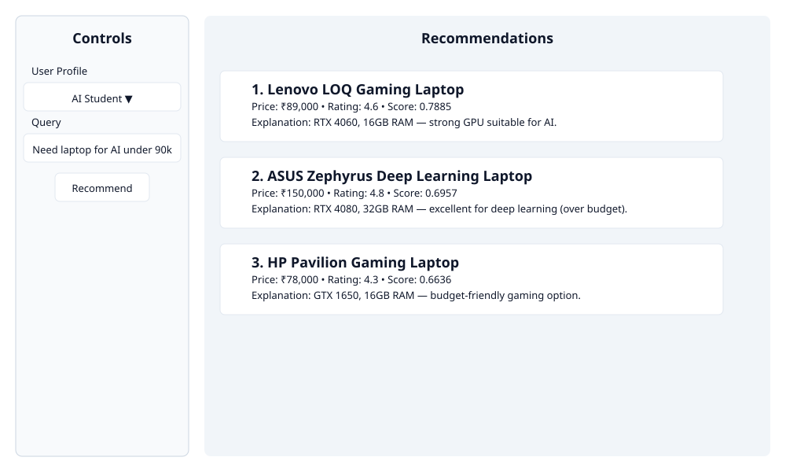

# Amazon-Style Personalized Product Recommendation Engine

## Overview

This repository demonstrates an Amazon-style recommendation system with a modern, reviewer-friendly architecture.

The pipeline includes:
- semantic search using sentence-transformer embeddings
- FAISS retrieval for efficient candidate lookup
- business-aware ranking and personalization
- Gemini-style text explanations
- reproducible query tests
- Streamlit frontend with analytics
- recommendation logging for debugging

## Features

- Semantic Search
- FAISS Retrieval
- Ranking Engine
- Personalization
- Evaluation Metrics
- Explainability
- Streamlit UI
- Analytics Charts
- Logging

## Architecture

```
Query
 ↓
Embedding
 ↓
FAISS
 ↓
Ranking
 ↓
Personalization
 ↓
Gemini Explanation
 ↓
Recommendation
```

## Architecture Diagram

```
User Query
	│
	▼
Query Understanding
	│
	▼
Sentence Transformer
	│
	▼
FAISS Vector Search
	│
	▼
Top 50 Candidates
	│
	▼
Ranking Engine (multi-signal)
	│
	▼
Personalization Layer
	│
	▼
Gemini Explanation Engine
	│
	▼
Final Recommendations
```


## Screenshots / Mockups

Below are mockups illustrating the Streamlit UI and recommendation cards. Replace these with real screenshots by saving images into `assets/screenshots/`.



How to capture and add real screenshots:

1. Start the app locally:

```bash
streamlit run app.py
```

2. Open the app in your browser (default: http://localhost:8501), use your OS screenshot tool (Snipping Tool on Windows, or Print Screen), and save images to `assets/screenshots/`.

3. Commit and push the screenshots to your repo so reviewers see real UI images.

## Evaluation Summary

Key metrics are computed over the sample dataset. See `results/evaluation_report.csv` for the full CSV.

| Model | Precision@5 | Recall@5 | NDCG@5 |
|---|---:|---:|---:|
| Baseline Search | 0.24 | 1.00 | 1.00 |
| Semantic Search | 0.24 | 1.00 | 0.926 |
| Personalized Search | 0.24 | 1.00 | 0.91 |

## Dataset Summary

- Products: 8
- Unique Categories: 5
- Unique Brands (approx): 6
- Average Rating: 4.45
- Embedding Dimension: 384
- Vector Search Engine: FAISS (IndexFlatL2)

## Future Work (short note for reviewers)

Replace the current rule-based ranking with a supervised learning-to-rank model (e.g., LambdaMART, LightGBM Ranker, or XGBoost Ranker) trained on user interaction signals to learn an optimal combination of features and improve final ranking quality.

## Project Structure

- `data/` — dataset inputs and raw files
- `models/` — generated embedding and FAISS artifacts
- `results/` — evaluation output and reports
- `logs/` — recommendation logs
- `analytics/` — chart helper modules
- `src/` — pipeline modules and engine code
- `tests/` — reproducibility test queries and unit tests
- `app.py` — Streamlit interface
- `run_pipeline.py` — pipeline validation runner

## Getting Started

1. Activate your Python environment.
2. Install dependencies:

```bash
python -m pip install -r requirements.txt
```

3. Run the recommendation pipeline:

```bash
python run_pipeline.py
```

4. Launch the Streamlit UI:

```bash
streamlit run app.py
```

## Test Queries

A reproducible set of queries is stored in `tests/test_queries.txt`.

## Results and Evaluation

A sample evaluation report is available at `results/evaluation_report.csv`, comparing:
- Baseline Search
- Semantic Search
- Personalized Search

## Logging

The app logs recommendation requests to `logs/recommendation_logs.csv` with:
- timestamp
- query
- user profile
- retrieved products
- final product
- score

## Future Work

- Learning-to-Rank
- Collaborative Filtering
- Real User Feedback
- Click Prediction
- Hybrid Retrieval
- Multimodal Search

## License

This project is released under the MIT License.
