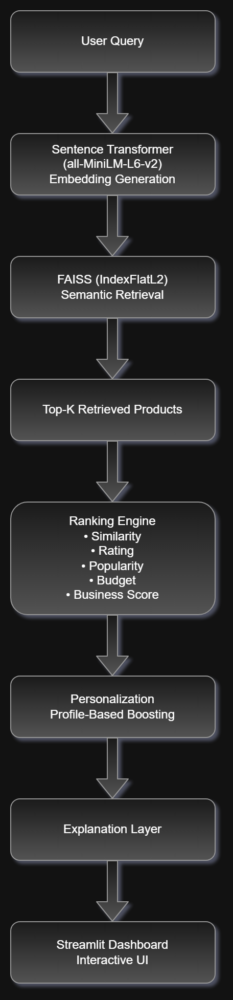
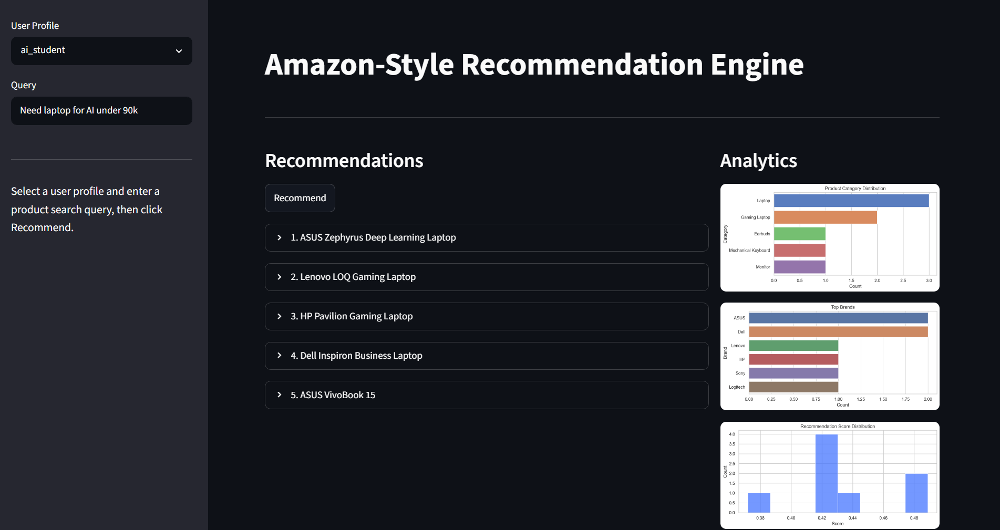
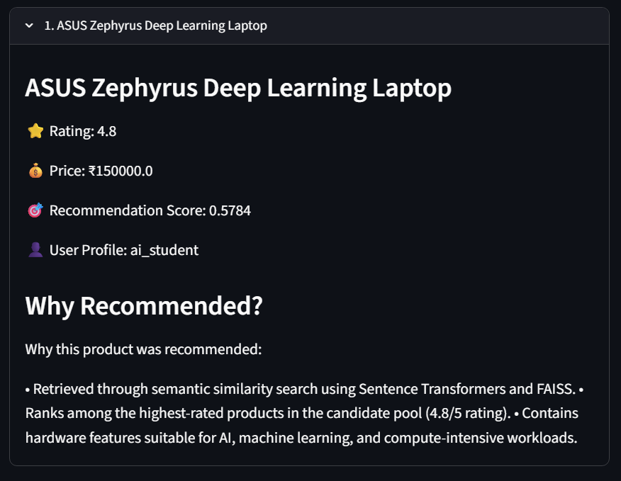
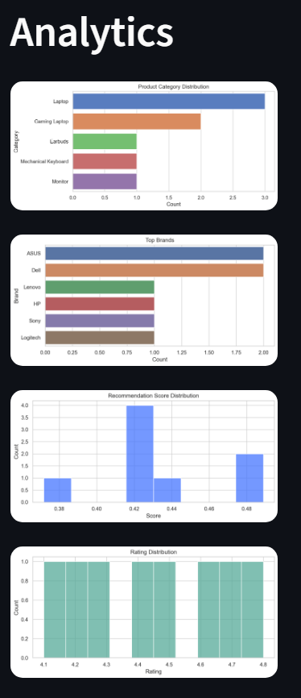

# Amazon-Style Personalized Product Recommendation Engine

An end-to-end Machine Learning Recommendation System inspired by modern e-commerce platforms such as Amazon. This project combines Semantic Search, Vector Retrieval, Business-Aware Ranking, Personalization, Explainable AI, and an Interactive Analytics Dashboard to deliver highly relevant product recommendations.

The system demonstrates a production-style recommendation pipeline using Sentence Transformers and FAISS for semantic retrieval, followed by a multi-stage ranking and personalization framework.

---

# Project Overview

Traditional keyword-based search systems often fail to understand user intent. This project addresses that limitation by leveraging transformer-based semantic embeddings and vector similarity search.

The recommendation engine:

* Understands semantic meaning of user queries
* Retrieves relevant products using vector search
* Applies business-aware ranking signals
* Personalizes recommendations based on user profiles
* Generates human-readable explanations
* Provides interactive visualization and analytics

---

# Key Features

## Semantic Search

* Sentence Transformer embeddings
* Context-aware retrieval
* Better than simple keyword matching

## Vector Search

* FAISS IndexFlatL2
* Efficient nearest-neighbor search
* Fast Top-K candidate retrieval

## Multi-Signal Ranking Engine

Products are ranked using multiple signals:

* Semantic Similarity
* Product Rating
* Popularity
* Budget Compatibility
* Business Quality Score

## Personalization Layer

Supports profile-aware recommendation boosting:

* Gaming Users
* Students
* AI/ML Students

## Explainable AI

Every recommendation includes reasoning based on:

* Query relevance
* Rating quality
* Hardware suitability
* User preferences
* Ranking signals

## Interactive Dashboard

Streamlit-based interface featuring:

* Product Search
* User Profile Selection
* Recommendation Visualization
* Analytics Dashboard
* Recommendation Explanations

## Evaluation Framework

Implemented evaluation metrics:

* Precision@K
* Recall@K
* NDCG@K

---

# System Architecture



## Recommendation Pipeline

```text
User Query
      ↓
Sentence Transformer
(all-MiniLM-L6-v2)
Embedding Generation
      ↓
FAISS (IndexFlatL2)
Semantic Retrieval
      ↓
Top-K Candidate Products
      ↓
Ranking Engine
• Similarity
• Rating
• Popularity
• Budget
• Business Score
      ↓
Personalization
Profile-Based Boosting
      ↓
Explanation Layer
      ↓
Streamlit Dashboard
Interactive UI
```

---

# Technology Stack

## Machine Learning

* Sentence Transformers
* Hugging Face Transformers
* NumPy
* Pandas

## Vector Retrieval

* FAISS
* Semantic Search
* Dense Vector Embeddings

## Backend

* Python
* Modular Recommendation Engine

## Frontend

* Streamlit

## Analytics

* Matplotlib
* Seaborn

## Testing

* Unittest

---

# Project Workflow

## Step 1: Data Processing

Raw product and review data are cleaned and preprocessed.

Tasks:

* Missing value handling
* Duplicate removal
* Product aggregation
* Feature engineering

---

## Step 2: Text Representation

Product information is converted into semantic embeddings using:

```python
all-MiniLM-L6-v2
```

Embedding Dimension:

```text
384
```

---

## Step 3: Vector Indexing

Embeddings are stored inside a FAISS vector index.

Benefits:

* Fast retrieval
* Scalable similarity search
* Efficient nearest-neighbor lookup

---

## Step 4: Candidate Retrieval

User queries are embedded and matched against product vectors.

Output:

```text
Top-K Candidate Products
```

---

## Step 5: Ranking Engine

Candidate products are scored using:

```text
Final Score =
0.35 × Similarity
+ 0.25 × Rating
+ 0.15 × Popularity
+ 0.10 × Budget Match
+ 0.05 × Business Score
```

---

## Step 6: Personalization

Profile-specific boosts are applied.

Examples:

### Gaming User

Boosts:

* Gaming
* RTX
* Graphics
* ASUS
* Lenovo

### AI Student

Boosts:

* GPU
* Machine Learning
* Deep Learning
* High RAM

### Student

Boosts:

* Affordable
* Lightweight
* Battery Life

---

## Step 7: Explainability

Human-readable explanations are generated describing:

* Why the product was retrieved
* Ranking factors
* User-profile alignment
* Hardware suitability

---

# Application Screenshots

## Recommendation Dashboard



## Recommendation Results



## Analytics Dashboard



---

# Example Query

Input:

```text
Need laptop for AI under 90k
```

Output:

```text
1. ASUS Zephyrus Deep Learning Laptop
2. Lenovo LOQ Gaming Laptop
3. HP Pavilion Gaming Laptop
```

Each recommendation includes:

* Product Name
* Rating
* Price
* Recommendation Score
* User Profile
* Explanation

---

# Evaluation Metrics

Implemented:

| Metric      | Description                          |
| ----------- | ------------------------------------ |
| Precision@K | Relevant recommendations among top K |
| Recall@K    | Coverage of relevant products        |
| NDCG@K      | Ranking quality evaluation           |

Evaluation results are stored in:

```text
results/evaluation_report.csv
```

---

# Dataset

The project supports:

### Demonstration Dataset

Used for:

* Testing
* Reproducibility
* Streamlit UI Demonstration

### Real Amazon Dataset Support

Pipeline supports:

* Product metadata
* Product reviews
* Product aggregation
* Embedding generation
* Large-scale vector indexing

---

# Project Structure

```text
amazon-rec-engine/
│
├── analytics/
├── assets/
│   ├── system_architecture.png
│   └── screenshots/
│
├── data/
│   ├── raw/
│   └── processed/
│
├── logs/
├── models/
├── results/
├── src/
├── tests/
│
├── app.py
├── run_pipeline.py
├── requirements.txt
├── README.md
└── LICENSE
```

---

# Installation

Clone the repository:

```bash
git clone <repository-url>
cd amazon-rec-engine
```

Create virtual environment:

```bash
python -m venv venv
```

Activate environment:

### Windows

```bash
venv\Scripts\activate
```

### Linux / Mac

```bash
source venv/bin/activate
```

Install dependencies:

```bash
pip install -r requirements.txt
```

---

# Running the Project

Run the recommendation pipeline:

```bash
python run_pipeline.py
```

Launch Streamlit Dashboard:

```bash
streamlit run app.py
```

Run Unit Tests:

```bash
python -m unittest tests.test_recommendations
```

---

# Logging

Recommendation requests are automatically logged.

Location:

```text
logs/recommendation_logs.csv
```

Captured fields:

* Timestamp
* Query
* User Profile
* Retrieved Products
* Final Product
* Recommendation Score

---

# Future Improvements

## Learning-to-Rank

Replace rule-based ranking with:

* LambdaMART
* XGBoost Ranker
* LightGBM Ranker

## Hybrid Recommendation Systems

Combine:

* Content-Based Filtering
* Collaborative Filtering

## Real-Time Feedback Learning

Incorporate:

* Click Signals
* Purchase Signals
* User Interaction Data

## Multimodal Search

Support:

* Image Search
* Text Search
* Product Metadata

## Large-Scale Deployment

Potential deployment using:

* FastAPI
* Docker
* AWS
* Kubernetes

---

# License

This project is released under the MIT License.

---

# Author

Omjee R Giri
